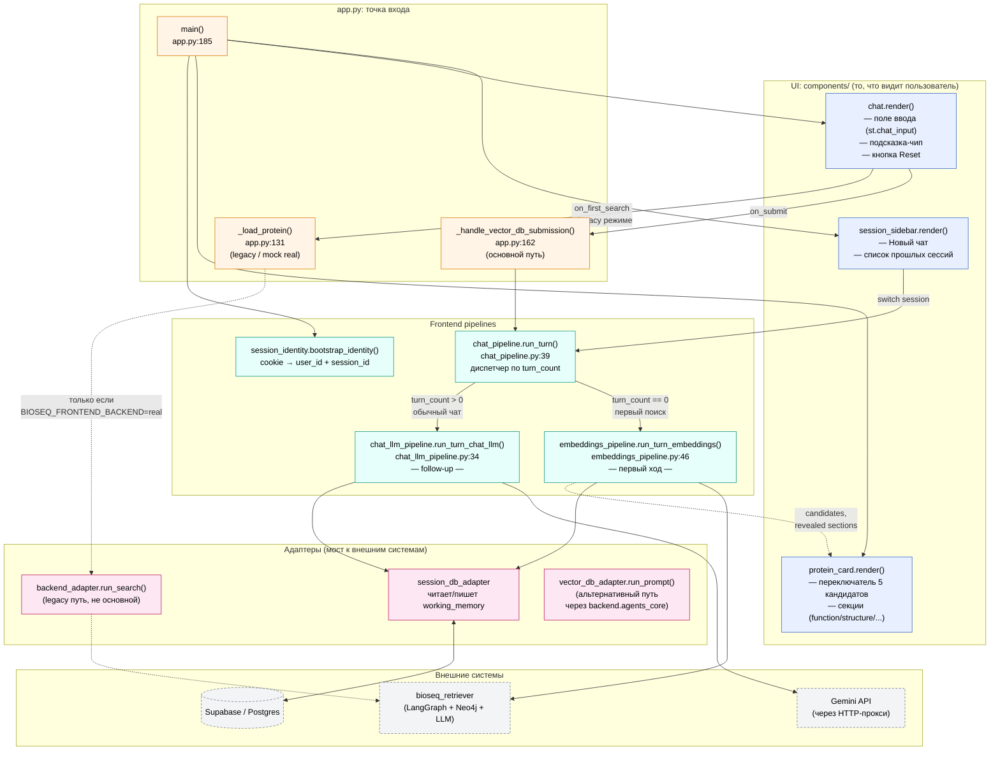

Я разобрался с [[Reranking]]’ом, используя `gemicli`. Я применил подход, похожий на тот, который использовал Илья, но с небольшими изменениями.

Сначала я построил **[[HNSW индекс|HNSW]]**-индекс с помощью [[FAISS]] и использовал его, чтобы ранжировать белковые последовательности.

Затем, для шага reranking’а, я запустил brute-force [[k-NN]] поиск — снова через FAISS, но на этот раз уже с учётом контекста.

Для начального ранжирования я использовал ту же T5-модель, что и они, чтобы получить [[Embedding]]’и последовательностей из базы данных. А для меньшего reranking-шага я взял простую модель, которую мы использовали во втором домашнем задании.

Возможно, позже я попробую [[ColBERT]] или что-то более мощное, но пока это, кажется, работает достаточно хорошо.

Построение HNSW-индекса занимает довольно много времени, поэтому пересоздавать его каждый раз было бы неэффективно. Так как embedding’и белковых последовательностей в этом случае статичны, мы можем один раз построить индекс и сохранить его. Тогда для каждой новой сессии мы просто загружаем уже готовый индекс, вместо того чтобы генерировать его заново с нуля.

Я пока не разбирался в деталях деплоя — это скорее про анализ сложности алгоритма.


[[HNSW индекс]]


**[[Ranking]]** — это первый этап поиска.
Например, у тебя база из 1 миллиона белков. Сравнивать запрос с каждым белком очень долго. Поэтому сначала система быстро находит, допустим, топ-100 или топ-1000 похожих кандидатов.
*Вот 100 белков, отсортированных от самого подходящего к менее подходящему*
**Ranking** — это упорядочивание кандидатов по некоторой функции релевантности, похожести, вероятности полезности или качества.

Но в retrieval-системах часто говорят так:

```
retrieval / initial ranking → быстрый первичный поиск кандидатов
reranking → более точная пересортировка найденных кандидатов
```

**Reranking** — это повторное ранжирование уже найденных кандидатов.
Важно: reranker обычно не ищет по всей базе. Он берёт уже найденный небольшой набор кандидатов и переоценивает их более дорогим/точным способом.


**k-NN** — это **k nearest neighbors**, то есть “k ближайших соседей”.





